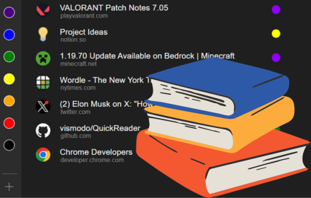

# QuickReader

Quickreader is a chrome extension that adds a simple yet effective reading list manager.

## Installing
1. Download the `quickreader.crx` file from [here](https://github.com/vismodo/QuickReader/releases/latest).

2. Drag the `quickreader.crx` file into your [extentions page](chrome://extensions/). **Make sure you have developer mode enabled!**

3. Enable the extension (if it is disabled). 

### **⚠️ KNOWN ISSUE: If you are unable to enable the extension, download the source code, unzip it and drag that into your extensions page instead.**

## Frequently Asked Questions

1. Why isn't this extension on the Chrome Web Store?
    > I'm not willing to pay Google $5 to get a Chrome extension developer account.
2. Why are there only 8 folders?
    > For simplicity...

## Credits

[@vismodo](https://github.com/vismodo)